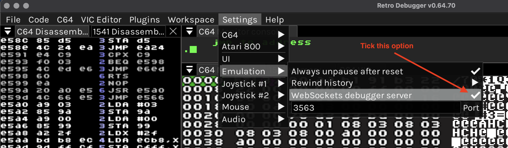
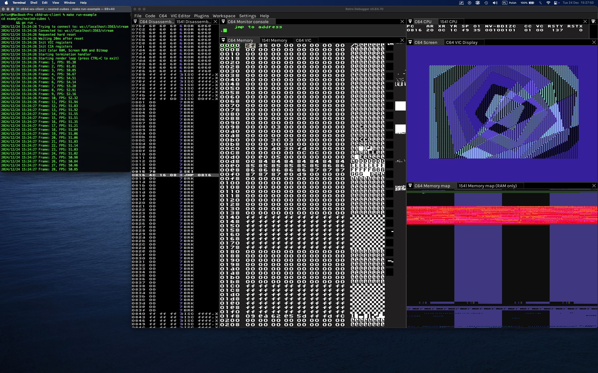

# Go WebSocket Client for Retro Debugger (formerly C64 Debugger)

# Description

This package is a Go implementation of WebSocket client for Retro Debugger (formerly C64 Debugger) emulator. It allows to connect to the emulator and send commands to it.

You can control the following aspects of the emulator:

- CPU:
  - Get Status
  - Get Counters
  - CPU read memory block (depends on a value of $01 address)
  - CPU write memory block (depends on a value of $01 address)
  - CPU memory breakpoints
  - Make JMP

- RAM:
  - Clear RAM
  - Read block
  - Write block

- Memory segments:
  - Read segment
  - Write segment

- CIA:
  - Read registers
  - Write registers

- VIC:
  - Read registers
  - Write registers

- SID:
  - Read registers
  - Write registers

- 1541 Drive CPU:
  - Memory read block
  - Memory write block

- 1541 Drive RAM:
  - Clear RAM
  - Read block
  - Write block

- 1541 Drive VIA:
  - Read registers
  - Write registers

- Joystick
  - Up (axis, port)
  - Down (axis, port)

- Keyboard
  - Up (key code)
  - Down (key code)

- Breakpoints
  - Raster breakpoints
  - CPU breakpoints

# Usage
To use this package, you need to add it to your project first:
```
go get github.com/mojzesh/go-ws-client
```

and then import it:
```
import (
  "github.com/mojzesh/c64d-ws-client/c64dws"
)
```

To create a client instance:
```go
emulator := c64dws.EmulatorC64 // use C64 emulator
apiType := c64dws.StreamAPI // use Stream API `/stream`
client := c64dws.NewDefaultClient(emulator, apiType)
response, err := client.Connect()
if err != nil {
    log.Fatal(err)
}
```

to close the connection:
```go
client.Close()
```

For real usage examples see the contents of `examples/nested-cubes` and `tests` directories.

# API Reference
Make sure you have installed godoc tool:
- Using Makefile: `make install-godoc`
- Using Go: `go install golang.org/x/tools/cmd/godoc@latest`

To see documentation:
- Using Makefile: `make godoc`
- Using Go: `godoc -http=:6060 -index`

Navigate to: http://localhost:6060/pkg/github.com/mojzesh/c64d-ws-client/c64dws/ in your browser.

# Running example

First of all, make sure that the WebSockets server is enabled, navigate to: `Settings -> Emulation -> WebSockets debugger server`, and tick it on.



- Using Makefile: `make run-example`



For more details read [Nested-Cubes Readme](examples/nested-cubes/README.md) located in `examples/nested-cubes` directory.

# Running tests
- Using Makefile: `make test`
- Using Go:
    - `go test ./...`
    - or `go test -v -count=1 ./...`

# Authors:
- C64D-WS-Client: Artur 'Mojzesh' Torun
- Retro Debugger: Marcin 'Slajerek' Skoczylas

# License:
- MIT
